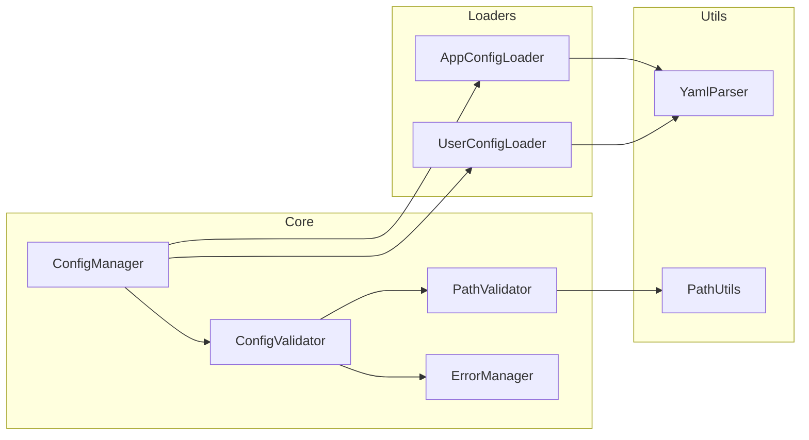

# BreakdownConfig

アプリケーションとユーザーの設定を管理するためのDenoライブラリです。このライブラリは、アプリケーション固有の場所とユーザー固有の場所の両方から設定ファイルを読み込み、マージする方法を提供し、安全性と検証に重点を置いています。

## 機能

- 固定された場所（`./.agent/breakdown/config/`）からアプリケーション設定を読み込み、検証
- 同じ場所からオプションのユーザー設定を読み込み
- 環境別設定（プレフィックス）のサポート
- 設定構造とパスの検証
- ユーザー設定をアプリケーションのデフォルトと明確な上書きルールでマージ
- 型安全な設定処理
- パス安全性の検証
- 一元化されたエラー管理

## アーキテクチャ

### コンポーネント構造


## インストール

```typescript
import { BreakdownConfig } from "https://jsr.io/@tettuan/breakdownconfig";
```

## 使用方法

### 基本的な使用方法
```typescript
// 新しい設定インスタンスを作成
const config = new BreakdownConfig();

// アプリケーションとユーザーの設定を読み込み
await config.loadConfig();

// マージされた設定を取得
const settings = config.getConfig();
```

### 環境固有の設定（プレフィックス指定）
```typescript
// デフォルト設定の使用
const config = new BreakdownConfig();

// 環境固有の設定セットを指定
const prodConfig = new BreakdownConfig("production");
const devConfig = new BreakdownConfig("development");

// 特定のベースディレクトリを指定（設定セット名はデフォルト）
const baseConfig = new BreakdownConfig("/path/to/project");
```

### 設定ファイルの読み込み場所

#### デフォルトパス
BreakdownConfigは引数を指定しない場合、以下の固定パスから設定ファイルを読み込みます：

```typescript
// 引数なしの場合
const config = new BreakdownConfig();
// → カレントディレクトリの ./.agent/breakdown/config/ から読み込み
```

**読み込まれるファイル**:
- アプリケーション設定: `./.agent/breakdown/config/app.yml` （必須）
- ユーザー設定: `./.agent/breakdown/config/user.yml` （オプション）

#### カスタムベースディレクトリ
ベースディレクトリを指定した場合：

```typescript
const config = new BreakdownConfig("/path/to/project");
// → /path/to/project/.agent/breakdown/config/ から読み込み
```

#### 環境固有設定
設定セット名を指定した場合：

```typescript
const config = new BreakdownConfig("production");
// → ./.agent/breakdown/config/production-app.yml と production-user.yml から読み込み
```

### 設定構造

#### アプリケーション設定（必須）
**デフォルト設定**: `./.agent/breakdown/config/app.yml`
**環境固有設定**: `./.agent/breakdown/config/{prefix}-app.yml`

```yaml
working_dir: "./.agent/breakdown"
app_prompt:
  base_dir: "./.agent/breakdown/prompts/app"
app_schema:
  base_dir: "./.agent/breakdown/schema/app"
```

#### ユーザー設定（オプション）
**デフォルト設定**: `./.agent/breakdown/config/user.yml`
**環境固有設定**: `./.agent/breakdown/config/{prefix}-user.yml`

```yaml
app_prompt:
  base_dir: "./prompts/user"
app_schema:
  base_dir: "./schema/user"
```

**重要**: 
- アプリケーション設定とユーザー設定は同じディレクトリ（`./.agent/breakdown/config/`）に配置されます
- ユーザー設定は、working_dirの設定値に関係なく、常に固定の場所から読み込まれます
- 設定ファイルが存在しない場合、アプリケーション設定は必須のためエラーになりますが、ユーザー設定はオプションのため正常に動作します

### 設定マージルール

1. ユーザー設定はアプリケーション設定を上書き
2. ネストされた設定の場合：
   - 上書きは既存のユーザー設定キーの最上位レベルで発生
   - 明示的に上書きされない限り、下位レベルの項目は保持
   - 項目は明示的にnullに設定された場合のみ削除

### 環境固有設定（プレフィックス）

設定セット名（プレフィックス）を指定することで、環境別やシナリオ別の設定を管理できます：

```typescript
// デフォルト設定：app.yml と user.yml を使用
const defaultConfig = new BreakdownConfig();

// 本番環境設定：production-app.yml と production-user.yml を使用
const prodConfig = new BreakdownConfig("production");

// 開発環境設定：development-app.yml と development-user.yml を使用
const devConfig = new BreakdownConfig("development");
```

#### ファイル命名規則

| 設定セット名 | アプリ設定ファイル | ユーザー設定ファイル |
|------------|-----------------|-------------------|
| 未指定（デフォルト） | `app.yml` | `user.yml` |
| "production" | `production-app.yml` | `production-user.yml` |
| "development" | `development-app.yml` | `development-user.yml` |
| "{custom}" | `{custom}-app.yml` | `{custom}-user.yml` |

すべてのファイルは `./.agent/breakdown/config/` ディレクトリに配置されます。

## エラーハンドリング

ライブラリは包括的なエラーハンドリングを実装しています：

```typescript
enum ErrorCode {
    // 設定ファイルエラー (1000s)
    APP_CONFIG_NOT_FOUND = "ERR1001",
    APP_CONFIG_INVALID = "ERR1002",
    USER_CONFIG_INVALID = "ERR1003",
    
    // 必須フィールドエラー (2000s)
    REQUIRED_FIELD_MISSING = "ERR2001",
    INVALID_FIELD_TYPE = "ERR2002",
    
    // パス検証エラー (3000s)
    INVALID_PATH_FORMAT = "ERR3001",
    PATH_TRAVERSAL_DETECTED = "ERR3002",
    ABSOLUTE_PATH_NOT_ALLOWED = "ERR3003"
}
```

## サンプル

このリポジトリには、ライブラリの使用方法を示す2つのサンプルが含まれています：

### 1. 設定例 (config-example)
基本的な設定ファイルの読み込みと使用方法を示すサンプルです。
- アプリケーション設定の読み込み
- パスの検証と解決
- エラーハンドリング
- ログ出力

詳細は [examples/config-example/README.md](./examples/config-example/README.md) を参照してください。

### 2. プロンプトマネージャー (prompt-manager)
マルチプロンプト管理アプリケーションのサンプルです。
- プロンプトとスキーマファイルの管理
- アプリケーション設定とユーザー設定の統合
- ディレクトリ構造の自動生成
- エラーハンドリング
- ログ出力

詳細は [examples/prompt-manager/README.md](./examples/prompt-manager/README.md) を参照してください。

## 開発

### テストの実行

テストは階層的に構成されています：
1. 基本機能テスト
2. コア機能テスト
3. エッジケーステスト
4. エラーケーステスト

```bash
deno test
```

### 型チェック

```bash
deno check src/mod.ts
```

### リンティング

```bash
deno lint
```

### テストカバレッジ要件
- ステートメントカバレッジ: 90%以上
- ブランチカバレッジ: 85%以上
- 関数カバレッジ: 95%以上

## ライセンス

MIT 