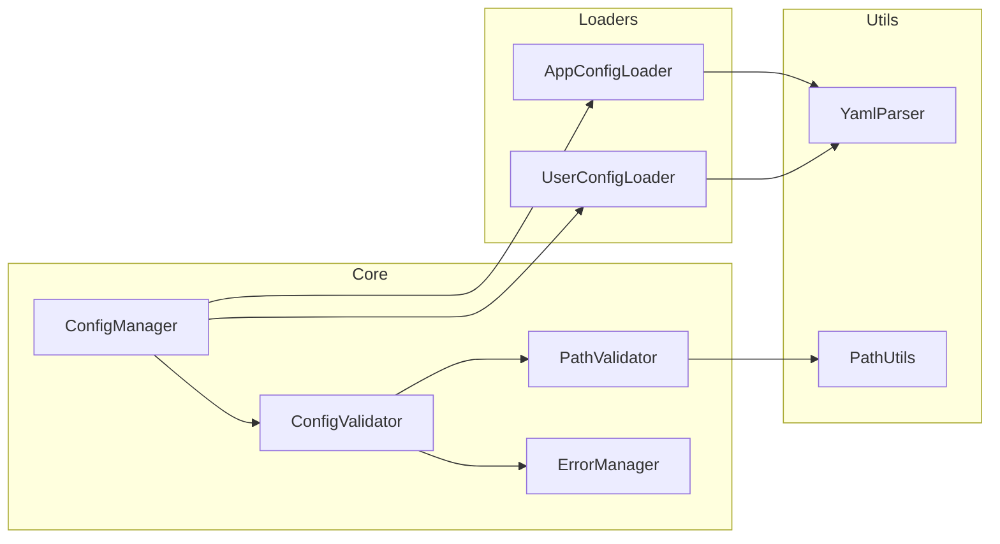

# BreakdownConfig

アプリケーションとユーザーの設定を管理するためのDenoライブラリです。このライブラリは、アプリケーション固有の場所とユーザー固有の場所の両方から設定ファイルを読み込み、マージする方法を提供し、安全性と検証に重点を置いています。

## 機能

- **Total Function設計**: 例外ではなくResult型による型安全なエラーハンドリング
- **統合エラー管理**: UnifiedErrorシステムによる多言語対応エラーメッセージ
- **型安全な設定処理**: Discriminated UnionとSmart Constructorによる制約値型
- **設定ファイル統合**: アプリケーション設定とユーザー設定の明確な上書きルール
- **環境別設定サポート**: プレフィックスベースの名前付きプロファイル
- **包括的バリデーション**: 設定ファイル構文・パス形式・型制約の検証
- **カスタムバリデーション**: アプリケーション側での型定義ベース検証API
- **パス安全性保証**: 全域性原則に基づくパス種別の型分類
- **網羅的分岐処理**: switch文によるdefault不要な完全ケース処理

## アーキテクチャ

### コンポーネント構造



## バリデーション機能

BreakdownConfigは設定ファイルと設定値の包括的なバリデーションを提供します：

### 設定ファイルのバリデーション

アプリケーション設定ファイルの自動バリデーション：

- **必須項目チェック**: `working_dir`、`app_prompt`、`app_schema`の存在確認
- **項目定義制約**: 事前定義された項目のみ許可（未定義項目は無視）
- **YAML構文チェック**: シンプルな単一ドキュメント形式の検証
- **パス形式チェック**: 相対パス/絶対パスの記法検証

### カスタムバリデーション API

アプリケーション側で柔軟なバリデーションを実行可能：

```typescript
// 型定義に基づくバリデーション
interface ConfigParamsType {
  demonstrativeType: {
    pattern: string;
  };
  layerType: {
    pattern: string;
  };
}

// 設定のバリデーション実行
const config = await BreakdownConfig.loadConfig("profilename");
if (Result.isOk(config)) {
  const validated = config.data.validate('params.two', ConfigParamsType);
  
  if (Result.isOk(validated)) {
    // バリデーション成功
    const validConfig = validated.data;
  } else {
    // バリデーションエラー
    const error = validated.error;
    console.error("設定値エラー:", errorManager.getUserMessage(error));
  }
}
```

### パスバリデーション

全域性原則に基づく型安全なパス検証：

```typescript
type PathType = 
  | { kind: 'relative_file'; path: string }      // './file.txt', '../dir/file.txt'
  | { kind: 'relative_directory'; path: string } // './dir', '../dir'
  | { kind: 'current_directory'; path: '.' | './' }
  | { kind: 'absolute'; path: string }           // '/absolute/path'

// パス種別ごとの処理ロジック
const pathResult = validatePath(configPath);
if (Result.isOk(pathResult)) {
  switch (pathResult.data.kind) {
    case 'relative_file':
      // 相対パスファイルの処理
      break;
    case 'absolute':
      // 絶対パスの処理
      break;
    // 他のケースも網羅的に処理
  }
}
```

### バリデーション実行タイミング

- **自動バリデーション**: 設定ファイル読み込み時に自動実行
- **手動バリデーション**: アプリケーション側が必要時に呼び出し
- **型定義ベース**: TypeScriptの型定義に基づく検証
- **エラー統合**: UnifiedErrorシステムとの統合

## インストール

```typescript
import { BreakdownConfig } from "https://jsr.io/@tettuan/breakdownconfig";
```

## 使用方法

### 基本的な使用方法

```typescript
// 設定を読み込み（Result型を返す）
const result = await BreakdownConfig.loadConfig();

if (Result.isOk(result)) {
  // 成功時：マージされた設定を取得
  const settings = result.data;
  console.log("Working directory:", settings.working_dir);
} else {
  // 失敗時：エラーハンドリング
  errorManager.logError(result.error);
  const userMessage = errorManager.getUserMessage(result.error);
  console.error("設定読み込みエラー:", userMessage);
}
```

### API設計

`BreakdownConfig` は静的メソッド `loadConfig` を提供し、2つのオプションパラメータを受け取ります：

```typescript
static async loadConfig(configSetName?: string, baseDir?: string): Promise<Result<MergedConfig, UnifiedError>>
```

#### パラメータ詳細

- **`configSetName`** (オプション): 環境名または設定セット名
  - 環境固有の設定ファイルを読み込むために使用
  - 例: `"production"`, `"staging"`, `"development"`
  - 指定した場合、`{configSetName}-app.yml` と `{configSetName}-user.yml` を読み込み

- **`baseDir`** (オプション): 設定ファイルのベースディレクトリ
  - デフォルトは現在の作業ディレクトリ (`""`)
  - 設定ファイルは `{baseDir}/.agent/breakdown/config/` から読み込み

#### 戻り値

- **Result型**: 成功と失敗を明示的に表現する型安全な戻り値
  - 成功時: `{ success: true, data: MergedConfig }`
  - 失敗時: `{ success: false, error: UnifiedError }`

#### 使用例

```typescript
// デフォルト使用 - カレントディレクトリからapp.ymlとuser.ymlを読み込み
const result = await BreakdownConfig.loadConfig();

// 環境固有の設定
const prodResult = await BreakdownConfig.loadConfig("production");
// 読み込み: production-app.yml と production-user.yml

// カスタムベースディレクトリ
const customResult = await BreakdownConfig.loadConfig(undefined, "/path/to/project");
// 読み込み: /path/to/project/.agent/breakdown/config/app.yml

// 環境固有 + カスタムベースディレクトリ
const envResult = await BreakdownConfig.loadConfig("staging", "/path/to/project");
// 読み込み: /path/to/project/.agent/breakdown/config/staging-app.yml

// エラーハンドリングの例
if (Result.isOk(result)) {
  console.log("設定読み込み成功:", result.data);
} else {
  const error = result.error;
  if (ErrorGuards.isConfigFileNotFound(error)) {
    console.error("設定ファイルが見つかりません:", error.path);
  } else if (ErrorGuards.isConfigParseError(error)) {
    console.error("設定ファイルの構文エラー:", error.syntaxError);
  } else {
    console.error("予期しないエラー:", errorManager.getUserMessage(error));
  }
}
```

#### 破壊的変更のお知らせ (Total Function Revolution)

⚠️ **Total Function Revolutionで設計が大幅に変更されました**

```typescript
// 旧API（throw-based、非推奨）
try {
  const config = new BreakdownConfig("production", "/path/to/project");
  await config.loadConfig();
  const settings = config.getConfig(); // ❌ 動作しません
} catch (error) {
  console.error(error.message);
}

// 新API（Result-based、推奨）
const result = await BreakdownConfig.loadConfig("production", "/path/to/project");
if (Result.isOk(result)) {
  const settings = result.data; // ✅ 型安全
} else {
  errorManager.logError(result.error); // ✅ 統合エラー管理
}

// 変更点：
// - インスタンスベース → 静的メソッドベース
// - 例外ベース → Result型ベース  
// - ErrorCode enum → UnifiedError型
// - 手動エラーハンドリング → 統合エラー管理システム
```

### 設定ファイルの読み込み場所

#### デフォルトパス

BreakdownConfigは引数を指定しない場合、以下の固定パスから設定ファイルを読み込みます：

```typescript
// 引数なしの場合
const config = new BreakdownConfig();
// → カレントディレクトリの ./.agent/breakdown/config/ から読み込み
```

**読み込まれるファイル**:

- アプリケーション設定: `./.agent/breakdown/config/app.yml` （必須）
- ユーザー設定: `./.agent/breakdown/config/user.yml` （オプション）

#### カスタムベースディレクトリ

ベースディレクトリを指定した場合：

```typescript
const config = new BreakdownConfig(undefined, "/path/to/project");
// → /path/to/project/.agent/breakdown/config/ から読み込み
```

#### 環境固有設定

設定セット名を指定した場合：

```typescript
const config = new BreakdownConfig("production");
// → ./.agent/breakdown/config/production-app.yml と production-user.yml から読み込み
```

### 設定構造

#### アプリケーション設定（必須）

**デフォルト設定**: `./.agent/breakdown/config/app.yml`
**環境固有設定**: `./.agent/breakdown/config/{prefix}-app.yml`

```yaml
working_dir: "./.agent/breakdown"
app_prompt:
  base_dir: "./.agent/breakdown/prompts/app"
app_schema:
  base_dir: "./.agent/breakdown/schema/app"
```

#### ユーザー設定（オプション）

**デフォルト設定**: `./.agent/breakdown/config/user.yml`
**環境固有設定**: `./.agent/breakdown/config/{prefix}-user.yml`

```yaml
app_prompt:
  base_dir: "./prompts/user"
app_schema:
  base_dir: "./schema/user"
```

**重要**:

- アプリケーション設定とユーザー設定は同じディレクトリ（`./.agent/breakdown/config/`）に配置されます
- ユーザー設定は、working_dirの設定値に関係なく、常に固定の場所から読み込まれます
- 設定ファイルが存在しない場合、アプリケーション設定は必須のためエラーになりますが、ユーザー設定はオプションのため正常に動作します

### 設定マージルール

1. ユーザー設定はアプリケーション設定を上書き
2. ネストされた設定の場合：
   - 上書きは既存のユーザー設定キーの最上位レベルで発生
   - 明示的に上書きされない限り、下位レベルの項目は保持
   - 項目は明示的にnullに設定された場合のみ削除

### 環境固有設定（プレフィックス）

設定セット名（プレフィックス）を指定することで、環境別やシナリオ別の設定を管理できます：

```typescript
// デフォルト設定：app.yml と user.yml を使用
const defaultConfig = new BreakdownConfig();

// 本番環境設定：production-app.yml と production-user.yml を使用
const prodConfig = new BreakdownConfig("production");

// 開発環境設定：development-app.yml と development-user.yml を使用
const devConfig = new BreakdownConfig("development");
```

#### ファイル命名規則

| 設定セット名         | アプリ設定ファイル    | ユーザー設定ファイル   |
| -------------------- | --------------------- | ---------------------- |
| 未指定（デフォルト） | `app.yml`             | `user.yml`             |
| "production"         | `production-app.yml`  | `production-user.yml`  |
| "development"        | `development-app.yml` | `development-user.yml` |
| "{custom}"           | `{custom}-app.yml`    | `{custom}-user.yml`    |

すべてのファイルは `./.agent/breakdown/config/` ディレクトリに配置されます。

## エラーハンドリング

ライブラリはTotal Function設計に基づく型安全なエラーハンドリングを実装しています：

### UnifiedError型システム

すべてのエラーはUnifiedError型として統一管理され、型安全なエラーハンドリングが可能です：

```typescript
type UnifiedError =
  | ConfigFileNotFoundError
  | ConfigParseError
  | ConfigValidationError
  | PathValidationError
  | UnknownError;

// 具体的なエラー型の例
interface ConfigFileNotFoundError {
  readonly kind: "CONFIG_FILE_NOT_FOUND";
  readonly path: string;
  readonly configType: "app" | "user";
  readonly searchedLocations?: string[];
  readonly message: string;
  readonly timestamp: Date;
}

interface ConfigParseError {
  readonly kind: "CONFIG_PARSE_ERROR";
  readonly path: string;
  readonly line?: number;
  readonly column?: number;
  readonly syntaxError: string;
  readonly message: string;
  readonly timestamp: Date;
}
```

### エラー管理システム

統合エラー管理システムによる多言語対応とログ機能：

```typescript
// エラーメッセージの取得（日本語対応）
errorManager.setLanguage("ja");
const userMessage = errorManager.getUserMessage(error);

// デバッグ情報の取得
const debugInfo = errorManager.getDebugMessage(error);

// エラーログ出力
errorManager.logError(error, "error");

// エラー詳細情報
const details = errorManager.getErrorDetails(error);
console.log("Title:", details.userFacing.title);
console.log("Suggestion:", details.userFacing.suggestion);
```

### Result型によるエラーハンドリング

すべてのAPIはResult型を返し、例外ではなく値としてエラーを扱います：

```typescript
// 型安全なエラーハンドリング
const result = await BreakdownConfig.loadConfig();

if (Result.isOk(result)) {
  // 成功時の処理
  const config = result.data;
} else {
  // 失敗時の処理
  const error = result.error;
  
  // 型ガードによる具体的なエラー処理
  if (ErrorGuards.isConfigFileNotFound(error)) {
    console.error(`設定ファイルが見つかりません: ${error.path}`);
  } else if (ErrorGuards.isConfigParseError(error)) {
    console.error(`YAML構文エラー: ${error.syntaxError}`);
  } else {
    console.error(`予期しないエラー: ${errorManager.getUserMessage(error)}`);
  }
}
```

## ユースケース

### 1. 複数設定セット管理

様々な目的で異なる設定セットを管理できます - 環境、機能、クライアント、またはアプリケーションのニーズに適した任意の分類：

```typescript
// 環境ベースの設定
const devResult = await BreakdownConfig.loadConfig("development");
const prodResult = await BreakdownConfig.loadConfig("production");

// 機能ベースの設定
const basicResult = await BreakdownConfig.loadConfig("basic-features");
const premiumResult = await BreakdownConfig.loadConfig("premium-features");

// クライアント固有の設定
const clientAResult = await BreakdownConfig.loadConfig("client-a");
const clientBResult = await BreakdownConfig.loadConfig("client-b");

// ロールベースの設定
const adminResult = await BreakdownConfig.loadConfig("admin");
const userResult = await BreakdownConfig.loadConfig("user");

// Result型による安全な設定利用
if (Result.isOk(devResult) && Result.isOk(premiumResult)) {
  console.log("開発環境設定:", devResult.data.working_dir);
  console.log("プレミアム機能設定:", premiumResult.data.app_prompt.base_dir);
}
```

**設定ファイルの例：**

- **環境セット:** `development-app.yml`, `production-app.yml`, `staging-app.yml`
- **機能セット:** `basic-features-app.yml`, `premium-features-app.yml`
- **クライアントセット:** `client-a-app.yml`, `client-b-app.yml`
- **ロールセット:** `admin-app.yml`, `user-app.yml`
- **カスタムセット:** `experiment-app.yml`, `legacy-app.yml`, `mobile-app.yml`

### 2. AIエージェント設定管理

AIエージェント用のプロンプト、スキーマ、作業ディレクトリをユーザーカスタマイゼーションと共に管理：

```typescript
// デフォルト設定のAIエージェント
const agentResult = await BreakdownConfig.loadConfig();

if (Result.isOk(agentResult)) {
  const settings = agentResult.data;
  // settings.app_prompt.base_dir をプロンプトテンプレートに使用
  // settings.app_schema.base_dir を検証スキーマに使用
  // settings.working_dir をエージェントワークスペースに使用
  
  console.log("プロンプトディレクトリ:", settings.app_prompt.base_dir);
  console.log("スキーマディレクトリ:", settings.app_schema.base_dir);
  console.log("作業ディレクトリ:", settings.working_dir);
} else {
  errorManager.logError(agentResult.error);
  console.error("設定読み込み失敗:", errorManager.getUserMessage(agentResult.error));
}
```

**アプリケーション設定 (app.yml):**

```yaml
working_dir: "./.agent/breakdown"
app_prompt:
  base_dir: "./.agent/breakdown/prompts/app"
  templates:
    - "system.md"
    - "user.md"
app_schema:
  base_dir: "./.agent/breakdown/schema/app"
  validation_rules:
    - "input.json"
    - "output.json"
```

**ユーザー設定 (user.yml):**

```yaml
app_prompt:
  base_dir: "./custom/prompts" # プロンプト場所の上書き
  custom_templates:
    - "my_template.md"
app_schema:
  strict_validation: false # カスタム設定の追加
```

### 3. マルチプロジェクト設定

単一のコードベースから複数プロジェクトの設定を管理：

```typescript
// プロジェクトAの設定
const projectAResult = await BreakdownConfig.loadConfig("project-a", "/workspace/project-a");

// プロジェクトBの設定
const projectBResult = await BreakdownConfig.loadConfig("project-b", "/workspace/project-b");

// 共有プロジェクトの設定
const sharedResult = await BreakdownConfig.loadConfig("shared", "/workspace/shared");

// 複数プロジェクトの設定を統合的に管理
const allResults = [projectAResult, projectBResult, sharedResult];
const validConfigs = allResults.filter(Result.isOk).map(result => result.data);

if (validConfigs.length === allResults.length) {
  console.log("すべてのプロジェクト設定が正常に読み込まれました");
  validConfigs.forEach((config, index) => {
    console.log(`プロジェクト${index + 1}の作業ディレクトリ:`, config.working_dir);
  });
} else {
  console.error("一部のプロジェクト設定の読み込みに失敗しました");
}
```

### 4. チームベース設定上書き

共有設定に影響を与えることなく、チームメンバーがアプリケーションの動作をカスタマイズできるように：

```typescript
// ベースチーム設定
const teamResult = await BreakdownConfig.loadConfig("team");

if (Result.isOk(teamResult)) {
  const teamConfig = teamResult.data;
  
  // 個々のチームメンバーはuser.ymlで上書き可能：
  console.log("チーム共通設定:");
  console.log("- 作業ディレクトリ:", teamConfig.working_dir);
  console.log("- プロンプトスタイル:", teamConfig.app_prompt.style);
  console.log("- スキーマ厳密モード:", teamConfig.app_schema.strict_mode);
  
  // ユーザー固有の設定は team-user.yml で上書きされる
} else {
  console.error("チーム設定読み込み失敗:", errorManager.getUserMessage(teamResult.error));
}
```

**チーム設定 (team-app.yml):**

```yaml
working_dir: "./team-workspace"
app_prompt:
  base_dir: "./shared-prompts"
  style: "formal"
app_schema:
  base_dir: "./shared-schemas"
  strict_mode: true
```

**ユーザー上書き (team-user.yml):**

```yaml
app_prompt:
  style: "casual" # 個人的な好み
  custom_dir: "./my-prompts" # 追加プロンプト
app_schema:
  strict_mode: false # 開発用の緩和された検証
```

### 5. 設定テストと検証

自動テストで異なる設定シナリオをテスト：

```typescript
// 最小設定でのテスト
const minimalResult = await BreakdownConfig.loadConfig();

// フル機能設定でのテスト  
const fullResult = await BreakdownConfig.loadConfig("full-features");

// カスタムパスでのテスト
const testResult = await BreakdownConfig.loadConfig("test", "./test-fixtures");

// Result型による型安全なテスト
assert(Result.isOk(minimalResult), "最小設定の読み込みに成功すること");
assert(Result.isOk(fullResult), "フル機能設定の読み込みに成功すること");
assert(Result.isOk(testResult), "テスト設定の読み込みに成功すること");

if (Result.isOk(testResult)) {
  const settings = testResult.data;
  // 設定構造の検証
  assert(settings.working_dir, "working_dirが設定されていること");
  assert(settings.app_prompt.base_dir, "プロンプトbase_dirが設定されていること");
  assert(settings.app_schema.base_dir, "スキーマbase_dirが設定されていること");
}

// エラーケースのテスト
const invalidResult = await BreakdownConfig.loadConfig("non-existent");
assert(Result.isErr(invalidResult), "存在しない設定は失敗すること");
assert(ErrorGuards.isConfigFileNotFound(invalidResult.error), "適切なエラー型が返されること");
```

### 6. 動的設定ロード

実行時条件に基づいて異なる設定をロード：

```typescript
// 環境変数に基づく設定ロード
const env = Deno.env.get("APP_ENV") || "development";
const envResult = await BreakdownConfig.loadConfig(env);

// コマンドライン引数に基づく設定ロード
const configSet = Deno.args[0] || "default";
const baseDir = Deno.args[1] || "";
const dynamicResult = await BreakdownConfig.loadConfig(configSet, baseDir);

// デプロイメントコンテキストに基づく設定ロード
const isProduction = Deno.env.get("DENO_DEPLOYMENT_ID") !== undefined;
const deployResult = await BreakdownConfig.loadConfig(isProduction ? "production" : "development");

// 設定結果の統合処理
const results = [envResult, dynamicResult, deployResult];
const successfulConfigs = results.filter(Result.isOk);

if (successfulConfigs.length > 0) {
  console.log(`${successfulConfigs.length}個の設定が正常に読み込まれました`);
  
  // 最初の有効な設定を使用
  const primaryConfig = successfulConfigs[0].data;
  console.log("使用する設定:", primaryConfig.working_dir);
} else {
  console.error("すべての設定読み込みに失敗しました");
  results.forEach((result, index) => {
    if (Result.isErr(result)) {
      console.error(`設定${index + 1}エラー:`, errorManager.getUserMessage(result.error));
    }
  });
}
```

### 7. 設定継承とレイヤリング

継承を使用した設定階層の作成：

```typescript
// ベース設定
const baseResult = await BreakdownConfig.loadConfig("base");

// ベースを拡張する機能固有設定
const featureResult = await BreakdownConfig.loadConfig("feature-x");

// 継承関係の確認と設定の比較
if (Result.isOk(baseResult) && Result.isOk(featureResult)) {
  const baseConfig = baseResult.data;
  const featureConfig = featureResult.data;
  
  console.log("ベース設定:");
  console.log("- working_dir:", baseConfig.working_dir);
  console.log("- プロンプト基盤:", baseConfig.app_prompt.base_dir);
  
  console.log("機能拡張設定:");
  console.log("- working_dir:", featureConfig.working_dir); // 継承
  console.log("- プロンプト拡張:", featureConfig.app_prompt.base_dir); // 上書き
  console.log("- 機能固有テンプレート:", featureConfig.app_prompt.feature_templates);
  
  // feature-x-app.yml はベース設定を参照可能
  // feature-x-user.yml はユーザーカスタマイゼーションを提供
} else {
  if (Result.isErr(baseResult)) {
    console.error("ベース設定エラー:", errorManager.getUserMessage(baseResult.error));
  }
  if (Result.isErr(featureResult)) {
    console.error("機能設定エラー:", errorManager.getUserMessage(featureResult.error));
  }
}
```

**ベース設定 (base-app.yml):**

```yaml
working_dir: "./.agent/breakdown"
app_prompt:
  base_dir: "./.agent/breakdown/prompts/base"
  common_templates:
    - "header.md"
    - "footer.md"
```

**機能設定 (feature-x-app.yml):**

```yaml
working_dir: "./.agent/breakdown" # 継承
app_prompt:
  base_dir: "./.agent/breakdown/prompts/feature-x" # 上書き
  common_templates: # ベースから継承
    - "header.md"
    - "footer.md"
  feature_templates: # 追加テンプレート
    - "feature-x-prompt.md"
```

## サンプル

このリポジトリには、ライブラリの使用方法を示す2つのサンプルが含まれています：

### 1. 設定例 (config-example)

基本的な設定ファイルの読み込みと使用方法を示すサンプルです。

- アプリケーション設定の読み込み
- パスの検証と解決
- エラーハンドリング
- ログ出力

詳細は [examples/config-example/README.md](./examples/config-example/README.md) を参照してください。

### 2. プロンプトマネージャー (prompt-manager)

マルチプロンプト管理アプリケーションのサンプルです。

- プロンプトとスキーマファイルの管理
- アプリケーション設定とユーザー設定の統合
- ディレクトリ構造の自動生成
- エラーハンドリング
- ログ出力

詳細は [examples/prompt-manager/README.md](./examples/prompt-manager/README.md) を参照してください。

## 開発

### テストの実行

テストは階層的に構成されています：

1. 基本機能テスト
2. コア機能テスト
3. エッジケーステスト
4. エラーケーステスト

```bash
deno test
```

### 型チェック

```bash
deno check src/mod.ts
```

### リンティング

```bash
deno lint
```

### テストカバレッジ要件

- ステートメントカバレッジ: 90%以上
- ブランチカバレッジ: 85%以上
- 関数カバレッジ: 95%以上

## ライセンス

MIT
