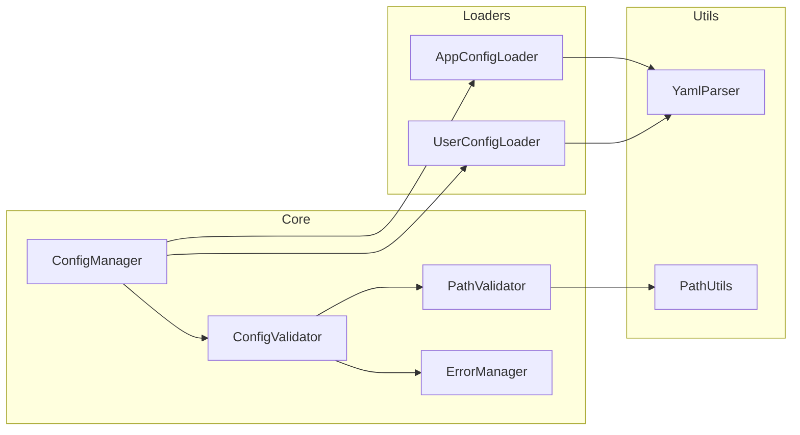

# BreakdownConfig

アプリケーションとユーザーの設定を管理するためのDenoライブラリです。このライブラリは、アプリケーション固有の場所とユーザー固有の場所の両方から設定ファイルを読み込み、マージする方法を提供し、安全性と検証に重点を置いています。

## 機能

- 固定された場所からアプリケーション設定を読み込み、検証
- 作業ディレクトリからオプションのユーザー設定を読み込み
- 設定構造とパスの検証
- ユーザー設定をアプリケーションのデフォルトと明確な上書きルールでマージ
- 型安全な設定処理
- パス安全性の検証
- 一元化されたエラー管理

## アーキテクチャ

### コンポーネント構造


## インストール

```typescript
import { BreakdownConfig } from "https://jsr.io/@tettuan/breakdownconfig";
```

## 使用方法

### 基本的な使用方法
```typescript
// 新しい設定インスタンスを作成
const config = new BreakdownConfig();

// アプリケーションとユーザーの設定を読み込み
await config.loadConfig();

// マージされた設定を取得
const settings = config.getConfig();
```

### 設定構造

#### アプリケーション設定（必須）
`./.agent/breakdown/config/app.yml`に配置：

```yaml
working_dir: "./.agent/breakdown"
app_prompt:
  base_dir: "./.agent/breakdown/prompts/app"
app_schema:
  base_dir: "./.agent/breakdown/schema/app"
```

#### ユーザー設定（オプション）
`$working_dir/config/user.yml`に配置：

```yaml
app_prompt:
  base_dir: "./prompts/user"
app_schema:
  base_dir: "./schema/user"
```

### 設定マージルール

1. ユーザー設定はアプリケーション設定を上書き
2. ネストされた設定の場合：
   - 上書きは既存のユーザー設定キーの最上位レベルで発生
   - 明示的に上書きされない限り、下位レベルの項目は保持
   - 項目は明示的にnullに設定された場合のみ削除

## エラーハンドリング

ライブラリは包括的なエラーハンドリングを実装しています：

```typescript
enum ErrorCode {
    // 設定ファイルエラー (1000s)
    APP_CONFIG_NOT_FOUND = "ERR1001",
    APP_CONFIG_INVALID = "ERR1002",
    USER_CONFIG_INVALID = "ERR1003",
    
    // 必須フィールドエラー (2000s)
    REQUIRED_FIELD_MISSING = "ERR2001",
    INVALID_FIELD_TYPE = "ERR2002",
    
    // パス検証エラー (3000s)
    INVALID_PATH_FORMAT = "ERR3001",
    PATH_TRAVERSAL_DETECTED = "ERR3002",
    ABSOLUTE_PATH_NOT_ALLOWED = "ERR3003"
}
```

## サンプル

このリポジトリには、ライブラリの使用方法を示す2つのサンプルが含まれています：

### 1. 設定例 (config-example)
基本的な設定ファイルの読み込みと使用方法を示すサンプルです。
- アプリケーション設定の読み込み
- パスの検証と解決
- エラーハンドリング
- ログ出力

詳細は [examples/config-example/README.md](./examples/config-example/README.md) を参照してください。

### 2. プロンプトマネージャー (prompt-manager)
マルチプロンプト管理アプリケーションのサンプルです。
- プロンプトとスキーマファイルの管理
- アプリケーション設定とユーザー設定の統合
- ディレクトリ構造の自動生成
- エラーハンドリング
- ログ出力

詳細は [examples/prompt-manager/README.md](./examples/prompt-manager/README.md) を参照してください。

## 開発

### テストの実行

テストは階層的に構成されています：
1. 基本機能テスト
2. コア機能テスト
3. エッジケーステスト
4. エラーケーステスト

```bash
deno test
```

### 型チェック

```bash
deno check src/mod.ts
```

### リンティング

```bash
deno lint
```

### テストカバレッジ要件
- ステートメントカバレッジ: 90%以上
- ブランチカバレッジ: 85%以上
- 関数カバレッジ: 95%以上

## ライセンス

MIT 