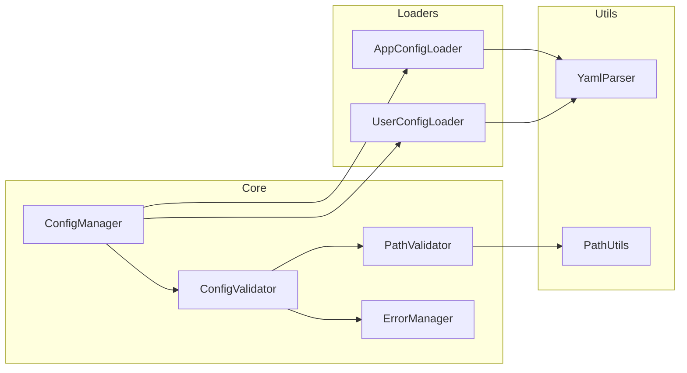

# BreakdownConfig

アプリケーションとユーザーの設定を管理するためのDenoライブラリです。このライブラリは、アプリケーション固有の場所とユーザー固有の場所の両方から設定ファイルを読み込み、マージする方法を提供し、安全性と検証に重点を置いています。

## 機能

- 固定された場所（`./.agent/breakdown/config/`）からアプリケーション設定を読み込み、検証
- 同じ場所からオプションのユーザー設定を読み込み
- 環境別設定（プレフィックス）のサポート
- 設定構造とパスの検証
- ユーザー設定をアプリケーションのデフォルトと明確な上書きルールでマージ
- 型安全な設定処理
- パス安全性の検証
- 一元化されたエラー管理

## アーキテクチャ

### コンポーネント構造



## インストール

```typescript
import { BreakdownConfig } from "https://jsr.io/@tettuan/breakdownconfig";
```

## 使用方法

### 基本的な使用方法

```typescript
// 新しい設定インスタンスを作成
const config = new BreakdownConfig();

// アプリケーションとユーザーの設定を読み込み
await config.loadConfig();

// マージされた設定を取得
const settings = config.getConfig();
```

### コンストラクターオプション

`BreakdownConfig` コンストラクターは2つのオプションパラメータを受け取ります：

```typescript
constructor(configSetName?: string, baseDir?: string)
```

#### パラメータ詳細

- **`configSetName`** (オプション): 環境名または設定セット名
  - 環境固有の設定ファイルを読み込むために使用
  - 例: `"production"`, `"staging"`, `"development"`
  - 指定した場合、`{configSetName}-app.yml` と `{configSetName}-user.yml` を読み込み

- **`baseDir`** (オプション): 設定ファイルのベースディレクトリ
  - デフォルトは現在の作業ディレクトリ (`""`)
  - 設定ファイルは `{baseDir}/.agent/breakdown/config/` から読み込み

#### 使用例

```typescript
// デフォルト使用 - カレントディレクトリからapp.ymlとuser.ymlを読み込み
const config = new BreakdownConfig();

// 環境固有の設定
const prodConfig = new BreakdownConfig("production");
// 読み込み: production-app.yml と production-user.yml

// デフォルト設定セットでカスタムベースディレクトリ
const customConfig = new BreakdownConfig(undefined, "/path/to/project");
// 読み込み: /path/to/project/.agent/breakdown/config/app.yml

// 環境固有 + カスタムベースディレクトリ
const envConfig = new BreakdownConfig("staging", "/path/to/project");
// 読み込み: /path/to/project/.agent/breakdown/config/staging-app.yml
```

#### 破壊的変更のお知らせ (v1.2.0)

⚠️ **v1.2.0でコンストラクターのパラメータ順序が変更されました**

```typescript
// v1.2.0以前（非推奨）
new BreakdownConfig("/path/to/project", "production"); // ❌ 動作しません

// v1.2.0以降（現在）
new BreakdownConfig("production", "/path/to/project"); // ✅ 正しい

// これらは変更なし（後方互換性あり）
new BreakdownConfig(); // ✅ そのまま動作
new BreakdownConfig("production"); // ✅ そのまま動作
```

### 設定ファイルの読み込み場所

#### デフォルトパス

BreakdownConfigは引数を指定しない場合、以下の固定パスから設定ファイルを読み込みます：

```typescript
// 引数なしの場合
const config = new BreakdownConfig();
// → カレントディレクトリの ./.agent/breakdown/config/ から読み込み
```

**読み込まれるファイル**:

- アプリケーション設定: `./.agent/breakdown/config/app.yml` （必須）
- ユーザー設定: `./.agent/breakdown/config/user.yml` （オプション）

#### カスタムベースディレクトリ

ベースディレクトリを指定した場合：

```typescript
const config = new BreakdownConfig(undefined, "/path/to/project");
// → /path/to/project/.agent/breakdown/config/ から読み込み
```

#### 環境固有設定

設定セット名を指定した場合：

```typescript
const config = new BreakdownConfig("production");
// → ./.agent/breakdown/config/production-app.yml と production-user.yml から読み込み
```

### 設定構造

#### アプリケーション設定（必須）

**デフォルト設定**: `./.agent/breakdown/config/app.yml`
**環境固有設定**: `./.agent/breakdown/config/{prefix}-app.yml`

```yaml
working_dir: "./.agent/breakdown"
app_prompt:
  base_dir: "./.agent/breakdown/prompts/app"
app_schema:
  base_dir: "./.agent/breakdown/schema/app"
```

#### ユーザー設定（オプション）

**デフォルト設定**: `./.agent/breakdown/config/user.yml`
**環境固有設定**: `./.agent/breakdown/config/{prefix}-user.yml`

```yaml
app_prompt:
  base_dir: "./prompts/user"
app_schema:
  base_dir: "./schema/user"
```

**重要**:

- アプリケーション設定とユーザー設定は同じディレクトリ（`./.agent/breakdown/config/`）に配置されます
- ユーザー設定は、working_dirの設定値に関係なく、常に固定の場所から読み込まれます
- 設定ファイルが存在しない場合、アプリケーション設定は必須のためエラーになりますが、ユーザー設定はオプションのため正常に動作します

### 設定マージルール

1. ユーザー設定はアプリケーション設定を上書き
2. ネストされた設定の場合：
   - 上書きは既存のユーザー設定キーの最上位レベルで発生
   - 明示的に上書きされない限り、下位レベルの項目は保持
   - 項目は明示的にnullに設定された場合のみ削除

### 環境固有設定（プレフィックス）

設定セット名（プレフィックス）を指定することで、環境別やシナリオ別の設定を管理できます：

```typescript
// デフォルト設定：app.yml と user.yml を使用
const defaultConfig = new BreakdownConfig();

// 本番環境設定：production-app.yml と production-user.yml を使用
const prodConfig = new BreakdownConfig("production");

// 開発環境設定：development-app.yml と development-user.yml を使用
const devConfig = new BreakdownConfig("development");
```

#### ファイル命名規則

| 設定セット名         | アプリ設定ファイル    | ユーザー設定ファイル   |
| -------------------- | --------------------- | ---------------------- |
| 未指定（デフォルト） | `app.yml`             | `user.yml`             |
| "production"         | `production-app.yml`  | `production-user.yml`  |
| "development"        | `development-app.yml` | `development-user.yml` |
| "{custom}"           | `{custom}-app.yml`    | `{custom}-user.yml`    |

すべてのファイルは `./.agent/breakdown/config/` ディレクトリに配置されます。

## エラーハンドリング

ライブラリは包括的なエラーハンドリングを実装しています：

```typescript
enum ErrorCode {
  // 設定ファイルエラー (1000s)
  APP_CONFIG_NOT_FOUND = "ERR1001",
  APP_CONFIG_INVALID = "ERR1002",
  USER_CONFIG_INVALID = "ERR1003",

  // 必須フィールドエラー (2000s)
  REQUIRED_FIELD_MISSING = "ERR2001",
  INVALID_FIELD_TYPE = "ERR2002",

  // パス検証エラー (3000s)
  INVALID_PATH_FORMAT = "ERR3001",
  PATH_TRAVERSAL_DETECTED = "ERR3002",
  ABSOLUTE_PATH_NOT_ALLOWED = "ERR3003",
}
```

## ユースケース

### 1. 複数設定セット管理

様々な目的で異なる設定セットを管理できます - 環境、機能、クライアント、またはアプリケーションのニーズに適した任意の分類：

```typescript
// 環境ベースの設定
const devConfig = new BreakdownConfig("development");
const prodConfig = new BreakdownConfig("production");

// 機能ベースの設定
const basicConfig = new BreakdownConfig("basic-features");
const premiumConfig = new BreakdownConfig("premium-features");

// クライアント固有の設定
const clientAConfig = new BreakdownConfig("client-a");
const clientBConfig = new BreakdownConfig("client-b");

// ロールベースの設定
const adminConfig = new BreakdownConfig("admin");
const userConfig = new BreakdownConfig("user");

await devConfig.loadConfig();
await premiumConfig.loadConfig();
await clientAConfig.loadConfig();
```

**設定ファイルの例：**

- **環境セット:** `development-app.yml`, `production-app.yml`, `staging-app.yml`
- **機能セット:** `basic-features-app.yml`, `premium-features-app.yml`
- **クライアントセット:** `client-a-app.yml`, `client-b-app.yml`
- **ロールセット:** `admin-app.yml`, `user-app.yml`
- **カスタムセット:** `experiment-app.yml`, `legacy-app.yml`, `mobile-app.yml`

### 2. AIエージェント設定管理

AIエージェント用のプロンプト、スキーマ、作業ディレクトリをユーザーカスタマイゼーションと共に管理：

```typescript
// デフォルト設定のAIエージェント
const agentConfig = new BreakdownConfig();
await agentConfig.loadConfig();

const settings = agentConfig.getConfig();
// settings.app_prompt.base_dir をプロンプトテンプレートに使用
// settings.app_schema.base_dir を検証スキーマに使用
// settings.working_dir をエージェントワークスペースに使用
```

**アプリケーション設定 (app.yml):**

```yaml
working_dir: "./.agent/breakdown"
app_prompt:
  base_dir: "./.agent/breakdown/prompts/app"
  templates:
    - "system.md"
    - "user.md"
app_schema:
  base_dir: "./.agent/breakdown/schema/app"
  validation_rules:
    - "input.json"
    - "output.json"
```

**ユーザー設定 (user.yml):**

```yaml
app_prompt:
  base_dir: "./custom/prompts" # プロンプト場所の上書き
  custom_templates:
    - "my_template.md"
app_schema:
  strict_validation: false # カスタム設定の追加
```

### 3. マルチプロジェクト設定

単一のコードベースから複数プロジェクトの設定を管理：

```typescript
// プロジェクトAの設定
const projectA = new BreakdownConfig("project-a", "/workspace/project-a");
await projectA.loadConfig();

// プロジェクトBの設定
const projectB = new BreakdownConfig("project-b", "/workspace/project-b");
await projectB.loadConfig();

// 共有プロジェクトの設定
const sharedConfig = new BreakdownConfig("shared", "/workspace/shared");
await sharedConfig.loadConfig();
```

### 4. チームベース設定上書き

共有設定に影響を与えることなく、チームメンバーがアプリケーションの動作をカスタマイズできるように：

```typescript
// ベースチーム設定
const teamConfig = new BreakdownConfig("team");
await teamConfig.loadConfig();

// 個々のチームメンバーはuser.ymlで上書き可能：
// - カスタム作業ディレクトリ
// - 個人的なプロンプト設定
// - 開発固有の設定
```

**チーム設定 (team-app.yml):**

```yaml
working_dir: "./team-workspace"
app_prompt:
  base_dir: "./shared-prompts"
  style: "formal"
app_schema:
  base_dir: "./shared-schemas"
  strict_mode: true
```

**ユーザー上書き (team-user.yml):**

```yaml
app_prompt:
  style: "casual" # 個人的な好み
  custom_dir: "./my-prompts" # 追加プロンプト
app_schema:
  strict_mode: false # 開発用の緩和された検証
```

### 5. 設定テストと検証

自動テストで異なる設定シナリオをテスト：

```typescript
// 最小設定でのテスト
const minimalConfig = new BreakdownConfig();
await minimalConfig.loadConfig();

// フル機能設定でのテスト
const fullConfig = new BreakdownConfig("full-features");
await fullConfig.loadConfig();

// カスタムパスでのテスト
const testConfig = new BreakdownConfig("test", "./test-fixtures");
await testConfig.loadConfig();

// 設定構造の検証
const settings = testConfig.getConfig();
assert(settings.working_dir);
assert(settings.app_prompt.base_dir);
assert(settings.app_schema.base_dir);
```

### 6. 動的設定ロード

実行時条件に基づいて異なる設定をロード：

```typescript
// 環境変数に基づく設定ロード
const env = Deno.env.get("APP_ENV") || "development";
const config = new BreakdownConfig(env);
await config.loadConfig();

// コマンドライン引数に基づく設定ロード
const configSet = Deno.args[0] || "default";
const baseDir = Deno.args[1] || "";
const dynamicConfig = new BreakdownConfig(configSet, baseDir);
await dynamicConfig.loadConfig();

// デプロイメントコンテキストに基づく設定ロード
const isProduction = Deno.env.get("DENO_DEPLOYMENT_ID") !== undefined;
const deployConfig = new BreakdownConfig(isProduction ? "production" : "development");
await deployConfig.loadConfig();
```

### 7. 設定継承とレイヤリング

継承を使用した設定階層の作成：

```typescript
// ベース設定
const baseConfig = new BreakdownConfig("base");
await baseConfig.loadConfig();

// ベースを拡張する機能固有設定
const featureConfig = new BreakdownConfig("feature-x");
await featureConfig.loadConfig();
// feature-x-app.yml はベース設定を参照可能
// feature-x-user.yml はユーザーカスタマイゼーションを提供
```

**ベース設定 (base-app.yml):**

```yaml
working_dir: "./.agent/breakdown"
app_prompt:
  base_dir: "./.agent/breakdown/prompts/base"
  common_templates:
    - "header.md"
    - "footer.md"
```

**機能設定 (feature-x-app.yml):**

```yaml
working_dir: "./.agent/breakdown" # 継承
app_prompt:
  base_dir: "./.agent/breakdown/prompts/feature-x" # 上書き
  common_templates: # ベースから継承
    - "header.md"
    - "footer.md"
  feature_templates: # 追加テンプレート
    - "feature-x-prompt.md"
```

## サンプル

このリポジトリには、ライブラリの使用方法を示す2つのサンプルが含まれています：

### 1. 設定例 (config-example)

基本的な設定ファイルの読み込みと使用方法を示すサンプルです。

- アプリケーション設定の読み込み
- パスの検証と解決
- エラーハンドリング
- ログ出力

詳細は [examples/config-example/README.md](./examples/config-example/README.md) を参照してください。

### 2. プロンプトマネージャー (prompt-manager)

マルチプロンプト管理アプリケーションのサンプルです。

- プロンプトとスキーマファイルの管理
- アプリケーション設定とユーザー設定の統合
- ディレクトリ構造の自動生成
- エラーハンドリング
- ログ出力

詳細は [examples/prompt-manager/README.md](./examples/prompt-manager/README.md) を参照してください。

## 開発

### テストの実行

テストは階層的に構成されています：

1. 基本機能テスト
2. コア機能テスト
3. エッジケーステスト
4. エラーケーステスト

```bash
deno test
```

### 型チェック

```bash
deno check src/mod.ts
```

### リンティング

```bash
deno lint
```

### テストカバレッジ要件

- ステートメントカバレッジ: 90%以上
- ブランチカバレッジ: 85%以上
- 関数カバレッジ: 95%以上

## ライセンス

MIT
