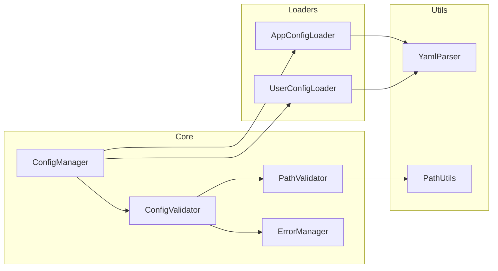

# BreakdownConfig

A Deno library for managing application and user configurations. This library provides a way to load and merge configuration files from both application-specific and user-specific locations, with a focus on safety and validation.

## Features

- Load and validate application configuration from a fixed location (`./.agent/climpt/config/`)
- Load optional user configuration from the same location
- Support for environment-specific configurations (prefixes)
- Configuration structure and path validation
- Merge user configuration with application defaults using clear override rules
- Type-safe configuration processing
- Path safety validation
- Centralized error management

## Architecture

### Component Structure



## Installation

```typescript
import { BreakdownConfig } from "https://jsr.io/@tettuan/breakdownconfig";
```

## Usage

### Basic Usage

```typescript
// Create a new configuration instance
const config = new BreakdownConfig();

// Load application and user configurations
await config.loadConfig();

// Get the merged configuration
const settings = config.getConfig();
```

### Constructor Options

The `BreakdownConfig` constructor accepts two optional parameters:

```typescript
constructor(configSetName?: string, baseDir?: string)
```

#### Parameter Details

- **`configSetName`** (optional): Environment name or configuration set name
  - Used to load environment-specific configuration files
  - Examples: `"production"`, `"staging"`, `"development"`
  - When specified, loads `{configSetName}-app.yml` and `{configSetName}-user.yml`

- **`baseDir`** (optional): Base directory for configuration files
  - Defaults to the current working directory (`""`)
  - Configuration files are loaded from `{baseDir}/.agent/climpt/config/`

#### Usage Examples

```typescript
// Default usage - load app.yml and user.yml from current directory
const config = new BreakdownConfig();

// Environment-specific configuration
const prodConfig = new BreakdownConfig("production");
// Loads: production-app.yml and production-user.yml

// Default configuration set with custom base directory
const customConfig = new BreakdownConfig(undefined, "/path/to/project");
// Loads: /path/to/project/.agent/climpt/config/app.yml

// Environment-specific + custom base directory
const envConfig = new BreakdownConfig("staging", "/path/to/project");
// Loads: /path/to/project/.agent/climpt/config/staging-app.yml
```

#### Breaking Change Notice (v1.2.0)

⚠️ **Constructor parameter order changed in v1.2.0**

```typescript
// v1.2.0 and earlier (deprecated)
new BreakdownConfig("/path/to/project", "production"); // ❌ Does not work

// v1.2.0 and later (current)
new BreakdownConfig("production", "/path/to/project"); // ✅ Correct

// These remain unchanged (backward compatible)
new BreakdownConfig(); // ✅ Still works
new BreakdownConfig("production"); // ✅ Still works
```

### Configuration File Loading Locations

#### Default Paths

When no arguments are specified, BreakdownConfig loads configuration files from the following fixed paths:

```typescript
// With no arguments
const config = new BreakdownConfig();
// → Loads from current directory's ./.agent/climpt/config/
```

**Files loaded**:

- Application configuration: `./.agent/climpt/config/app.yml` (required)
- User configuration: `./.agent/climpt/config/user.yml` (optional)

#### Custom Base Directory

When a base directory is specified:

```typescript
const config = new BreakdownConfig(undefined, "/path/to/project");
// → Loads from /path/to/project/.agent/climpt/config/
```

#### Environment-Specific Configuration

When a configuration set name is specified:

```typescript
const config = new BreakdownConfig("production");
// → Loads from ./.agent/climpt/config/production-app.yml and production-user.yml
```

### Configuration Structure

#### Application Configuration (Required)

**Default configuration**: `./.agent/climpt/config/app.yml`
**Environment-specific configuration**: `./.agent/climpt/config/{prefix}-app.yml`

```yaml
working_dir: "./.agent/climpt"
app_prompt:
  base_dir: "./.agent/climpt/prompts/app"
app_schema:
  base_dir: "./.agent/climpt/schema/app"
```

#### User Configuration (Optional)

**Default configuration**: `./.agent/climpt/config/user.yml`
**Environment-specific configuration**: `./.agent/climpt/config/{prefix}-user.yml`

```yaml
app_prompt:
  base_dir: "./prompts/user"
app_schema:
  base_dir: "./schema/user"
```

**Important**:

- Both application and user configurations are placed in the same directory (`./.agent/climpt/config/`)
- User configuration is always loaded from the fixed location, regardless of the working_dir setting value
- If configuration files don't exist, application configuration is required and will cause an error, but user configuration is optional and will work normally

### Configuration Merge Rules

1. User configuration overrides application configuration
2. For nested configurations:
   - Override occurs at the top level of existing user configuration keys
   - Lower-level items are preserved unless explicitly overridden
   - Items are only removed when explicitly set to null

### Environment-Specific Configuration (Prefixes)

You can manage environment-specific or scenario-specific configurations by specifying a configuration set name (prefix):

```typescript
// Default configuration: uses app.yml and user.yml
const defaultConfig = new BreakdownConfig();

// Production environment configuration: uses production-app.yml and production-user.yml
const prodConfig = new BreakdownConfig("production");

// Development environment configuration: uses development-app.yml and development-user.yml
const devConfig = new BreakdownConfig("development");
```

#### File Naming Convention

| Configuration Set Name | App Configuration File | User Configuration File |
| ---------------------- | ---------------------- | ----------------------- |
| Unspecified (default)  | `app.yml`              | `user.yml`              |
| "production"           | `production-app.yml`   | `production-user.yml`   |
| "development"          | `development-app.yml`  | `development-user.yml`  |
| "{custom}"             | `{custom}-app.yml`     | `{custom}-user.yml`     |

All files are placed in the `./.agent/climpt/config/` directory.

## Error Handling

The library implements comprehensive error handling:

```typescript
enum ErrorCode {
  // Configuration file errors (1000s)
  APP_CONFIG_NOT_FOUND = "ERR1001",
  APP_CONFIG_INVALID = "ERR1002",
  USER_CONFIG_INVALID = "ERR1003",

  // Required field errors (2000s)
  REQUIRED_FIELD_MISSING = "ERR2001",
  INVALID_FIELD_TYPE = "ERR2002",

  // Path validation errors (3000s)
  INVALID_PATH_FORMAT = "ERR3001",
  PATH_TRAVERSAL_DETECTED = "ERR3002",
  ABSOLUTE_PATH_NOT_ALLOWED = "ERR3003",
}
```

## Use Cases

### 1. Multiple Configuration Set Management

You can manage different configuration sets for various purposes - environments, features, clients, or any classification that fits your application needs:

```typescript
// Environment-based configurations
const devConfig = new BreakdownConfig("development");
const prodConfig = new BreakdownConfig("production");

// Feature-based configurations
const basicConfig = new BreakdownConfig("basic-features");
const premiumConfig = new BreakdownConfig("premium-features");

// Client-specific configurations
const clientAConfig = new BreakdownConfig("client-a");
const clientBConfig = new BreakdownConfig("client-b");

// Role-based configurations
const adminConfig = new BreakdownConfig("admin");
const userConfig = new BreakdownConfig("user");

await devConfig.loadConfig();
await premiumConfig.loadConfig();
await clientAConfig.loadConfig();
```

**Example configuration files:**

- **Environment sets:** `development-app.yml`, `production-app.yml`, `staging-app.yml`
- **Feature sets:** `basic-features-app.yml`, `premium-features-app.yml`
- **Client sets:** `client-a-app.yml`, `client-b-app.yml`
- **Role sets:** `admin-app.yml`, `user-app.yml`
- **Custom sets:** `experiment-app.yml`, `legacy-app.yml`, `mobile-app.yml`

### 2. AI Agent Configuration Management

Manage prompts, schemas, and working directories for AI agents with user customization:

```typescript
// AI agent with default configuration
const agentConfig = new BreakdownConfig();
await agentConfig.loadConfig();

const settings = agentConfig.getConfig();
// Use settings.app_prompt.base_dir for prompt templates
// Use settings.app_schema.base_dir for validation schemas
// Use settings.working_dir for agent workspace
```

**Application configuration (app.yml):**

```yaml
working_dir: "./.agent/climpt"
app_prompt:
  base_dir: "./.agent/climpt/prompts/app"
  templates:
    - "system.md"
    - "user.md"
app_schema:
  base_dir: "./.agent/climpt/schema/app"
  validation_rules:
    - "input.json"
    - "output.json"
```

**User configuration (user.yml):**

```yaml
app_prompt:
  base_dir: "./custom/prompts" # Override prompt location
  custom_templates:
    - "my_template.md"
app_schema:
  strict_validation: false # Add custom setting
```

### 3. Multi-Project Configuration

Manage configurations for multiple projects from a single codebase:

```typescript
// Project A configuration
const projectA = new BreakdownConfig("project-a", "/workspace/project-a");
await projectA.loadConfig();

// Project B configuration
const projectB = new BreakdownConfig("project-b", "/workspace/project-b");
await projectB.loadConfig();

// Shared project configuration
const sharedConfig = new BreakdownConfig("shared", "/workspace/shared");
await sharedConfig.loadConfig();
```

### 4. Team-Based Configuration Overrides

Allow team members to customize application behavior without affecting shared configurations:

```typescript
// Base team configuration
const teamConfig = new BreakdownConfig("team");
await teamConfig.loadConfig();

// Individual team members can override in user.yml:
// - Custom working directories
// - Personal prompt preferences
// - Development-specific settings
```

**Team configuration (team-app.yml):**

```yaml
working_dir: "./team-workspace"
app_prompt:
  base_dir: "./shared-prompts"
  style: "formal"
app_schema:
  base_dir: "./shared-schemas"
  strict_mode: true
```

**User overrides (team-user.yml):**

```yaml
app_prompt:
  style: "casual" # Personal preference
  custom_dir: "./my-prompts" # Additional prompts
app_schema:
  strict_mode: false # Relaxed validation for development
```

### 5. Configuration Testing and Validation

Test different configuration scenarios in automated tests:

```typescript
// Test with minimal configuration
const minimalConfig = new BreakdownConfig();
await minimalConfig.loadConfig();

// Test with full-featured configuration
const fullConfig = new BreakdownConfig("full-features");
await fullConfig.loadConfig();

// Test with custom paths
const testConfig = new BreakdownConfig("test", "./test-fixtures");
await testConfig.loadConfig();

// Validate configuration structure
const settings = testConfig.getConfig();
assert(settings.working_dir);
assert(settings.app_prompt.base_dir);
assert(settings.app_schema.base_dir);
```

### 6. Dynamic Configuration Loading

Load different configurations based on runtime conditions:

```typescript
// Load configuration based on environment variables
const env = Deno.env.get("APP_ENV") || "development";
const config = new BreakdownConfig(env);
await config.loadConfig();

// Load configuration based on command line arguments
const configSet = Deno.args[0] || "default";
const baseDir = Deno.args[1] || "";
const dynamicConfig = new BreakdownConfig(configSet, baseDir);
await dynamicConfig.loadConfig();

// Load configuration based on deployment context
const isProduction = Deno.env.get("DENO_DEPLOYMENT_ID") !== undefined;
const deployConfig = new BreakdownConfig(isProduction ? "production" : "development");
await deployConfig.loadConfig();
```

### 7. Configuration Inheritance and Layering

Create configuration hierarchies using inheritance:

```typescript
// Base configuration
const baseConfig = new BreakdownConfig("base");
await baseConfig.loadConfig();

// Feature-specific configuration extending base
const featureConfig = new BreakdownConfig("feature-x");
await featureConfig.loadConfig();
// feature-x-app.yml can reference base configuration
// feature-x-user.yml provides user customization
```

**Base configuration (base-app.yml):**

```yaml
working_dir: "./.agent/climpt"
app_prompt:
  base_dir: "./.agent/climpt/prompts/base"
  common_templates:
    - "header.md"
    - "footer.md"
```

**Feature configuration (feature-x-app.yml):**

```yaml
working_dir: "./.agent/climpt" # Inherited
app_prompt:
  base_dir: "./.agent/climpt/prompts/feature-x" # Override
  common_templates: # Inherited from base
    - "header.md"
    - "footer.md"
  feature_templates: # Additional templates
    - "feature-x-prompt.md"
```

## Examples

This repository includes two examples demonstrating library usage:

### 1. Configuration Example (config-example)

A sample showing basic configuration file loading and usage.

- Loading application configuration
- Path validation and resolution
- Error handling
- Log output

See [examples/config-example/README.md](./examples/config-example/README.md) for details.

### 2. Prompt Manager (prompt-manager)

A sample multi-prompt management application.

- Managing prompt and schema files
- Integration of application and user configurations
- Automatic directory structure generation
- Error handling
- Log output

See [examples/prompt-manager/README.md](./examples/prompt-manager/README.md) for details.

## Development

### Running Tests

Tests are organized hierarchically:

1. Basic functionality tests
2. Core functionality tests
3. Edge case tests
4. Error case tests

```bash
deno test
```

### Type Checking

```bash
deno check src/mod.ts
```

### Linting

```bash
deno lint
```

### Test Coverage Requirements

- Statement coverage: 90% or higher
- Branch coverage: 85% or higher
- Function coverage: 95% or higher

## License

MIT