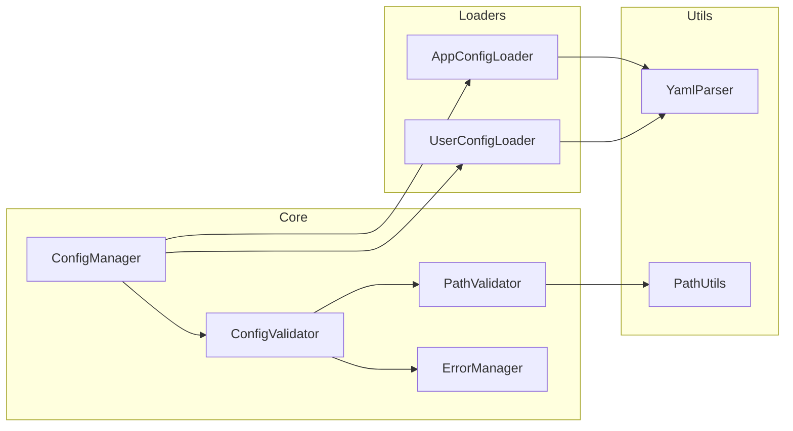

# BreakdownConfig

A Deno library for managing application and user configurations. This library provides a way to load and merge configuration files from both application-specific and user-specific locations, with a focus on safety and validation.

## Features

- Load and validate application configuration from a fixed location
- Load optional user configuration from a working directory
- Validate configuration structure and paths
- Merge user settings with application defaults with clear override rules
- Type-safe configuration handling
- Path safety validation
- Centralized error management

## Architecture

### Component Structure


## Installation

```typescript
import { BreakdownConfig } from "https://jsr.io/@tettuan/breakdownconfig";
```

## Usage

### Basic Usage
```typescript
// Create a new configuration instance
const config = new BreakdownConfig();

// Load both application and user configurations
await config.loadConfig();

// Get the merged configuration
const settings = config.getConfig();
```

### Configuration Structure

#### Application Configuration (Required)
Located at `/breakdown/config/app.yaml`:

```yaml
working_dir: "./.agent/breakdown"
app_prompt:
  base_dir: "/breakdown/prompts/app"
app_schema:
  base_dir: "/breakdown/schema/app"
```

#### User Configuration (Optional)
Located at `$working_dir/config/user.yaml`:

```yaml
app_prompt:
  base_dir: "./prompts/user"
app_schema:
  base_dir: "./schema/user"
```

### Configuration Merging Rules

1. User settings override application settings
2. For nested configurations:
   - Override occurs at the highest level of existing user config keys
   - Lower-level items are preserved unless explicitly overridden
   - Items are only deleted when explicitly set to null

## Error Handling

The library implements comprehensive error handling:

```typescript
enum ErrorCode {
    // Configuration File Errors (1000s)
    APP_CONFIG_NOT_FOUND = "ERR1001",
    APP_CONFIG_INVALID = "ERR1002",
    USER_CONFIG_INVALID = "ERR1003",
    
    // Required Field Errors (2000s)
    REQUIRED_FIELD_MISSING = "ERR2001",
    INVALID_FIELD_TYPE = "ERR2002",
    
    // Path Validation Errors (3000s)
    INVALID_PATH_FORMAT = "ERR3001",
    PATH_TRAVERSAL_DETECTED = "ERR3002",
    ABSOLUTE_PATH_NOT_ALLOWED = "ERR3003"
}
```

## Development

### Running Tests

Tests are structured hierarchically:
1. Basic functionality tests
2. Core feature tests
3. Edge case tests
4. Error case tests

```bash
deno test
```

### Type Checking

```bash
deno check src/mod.ts
```

### Linting

```bash
deno lint
```

### Test Coverage Requirements
- Statement coverage: 90%+
- Branch coverage: 85%+
- Function coverage: 95%+

## License

MIT
