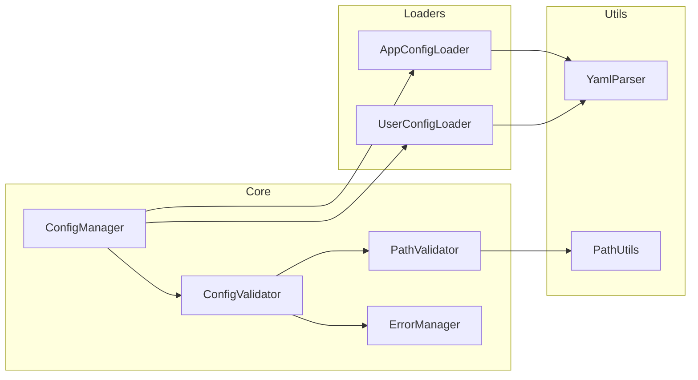

# BreakdownConfig

A Deno library for managing application and user configurations. This library provides a way to load and merge configuration files from both application-specific and user-specific locations, with a focus on safety and validation.

## Features

- Load and validate application configuration from a fixed location
- Load optional user configuration from a working directory
- Validate configuration structure and paths
- Merge user settings with application defaults with clear override rules
- Type-safe configuration handling
- Path safety validation
- Centralized error management

## Architecture

### Component Structure


## Installation

```typescript
import { BreakdownConfig } from "https://jsr.io/@tettuan/breakdownconfig";
```

## Usage

### Basic Usage
```typescript
// Create a new configuration instance
const config = new BreakdownConfig();

// Load both application and user configurations
await config.loadConfig();

// Get the merged configuration
const settings = config.getConfig();
```

### Constructor Options

The `BreakdownConfig` constructor accepts two optional parameters:

```typescript
constructor(configSetName?: string, baseDir?: string)
```

#### Parameter Details

- **`configSetName`** (optional): Environment or configuration set name
  - Used to load environment-specific configuration files
  - Example: `"production"`, `"staging"`, `"development"`
  - When specified, loads `{configSetName}-app.yml` and `{configSetName}-user.yml`

- **`baseDir`** (optional): Base directory for configuration files
  - Defaults to current working directory (`""`)
  - Configuration files are loaded from `{baseDir}/.agent/breakdown/config/`

#### Usage Examples

```typescript
// Default usage - loads app.yml and user.yml from current directory
const config = new BreakdownConfig();

// Environment-specific configuration
const prodConfig = new BreakdownConfig("production");
// Loads: production-app.yml and production-user.yml

// Custom base directory with default configuration set
const customConfig = new BreakdownConfig(undefined, "/path/to/project");
// Loads: /path/to/project/.agent/breakdown/config/app.yml

// Environment-specific with custom base directory
const envConfig = new BreakdownConfig("staging", "/path/to/project");
// Loads: /path/to/project/.agent/breakdown/config/staging-app.yml
```

#### Breaking Change Notice (v1.2.0)

⚠️ **Constructor parameter order changed in v1.2.0**

```typescript
// Before v1.2.0 (deprecated)
new BreakdownConfig("/path/to/project", "production") // ❌ Will break

// v1.2.0+ (current)
new BreakdownConfig("production", "/path/to/project") // ✅ Correct

// These remain unchanged (backward compatible)
new BreakdownConfig()                    // ✅ Still works
new BreakdownConfig("production")        // ✅ Still works
```

### Configuration Structure

#### Application Configuration (Required)
Located at `./.agent/breakdown/config/app.yml`:

```yaml
working_dir: "./.agent/breakdown"
app_prompt:
  base_dir: "./.agent/breakdown/prompts/app"
app_schema:
  base_dir: "./.agent/breakdown/schema/app"
```

#### User Configuration (Optional)
Located at `$working_dir/config/user.yml`:

```yaml
app_prompt:
  base_dir: "./prompts/user"
app_schema:
  base_dir: "./schema/user"
```

### Configuration Merging Rules

1. User settings override application settings
2. For nested configurations:
   - Override occurs at the highest level of existing user config keys
   - Lower-level items are preserved unless explicitly overridden
   - Items are only deleted when explicitly set to null

## Error Handling

The library implements comprehensive error handling:

```typescript
enum ErrorCode {
    // Configuration File Errors (1000s)
    APP_CONFIG_NOT_FOUND = "ERR1001",
    APP_CONFIG_INVALID = "ERR1002",
    USER_CONFIG_INVALID = "ERR1003",
    
    // Required Field Errors (2000s)
    REQUIRED_FIELD_MISSING = "ERR2001",
    INVALID_FIELD_TYPE = "ERR2002",
    
    // Path Validation Errors (3000s)
    INVALID_PATH_FORMAT = "ERR3001",
    PATH_TRAVERSAL_DETECTED = "ERR3002",
    ABSOLUTE_PATH_NOT_ALLOWED = "ERR3003"
}
```

## Use Cases

### 1. Multi-Environment Application Configuration

Deploy the same application across different environments (development, staging, production) with environment-specific settings:

```typescript
// Development environment
const devConfig = new BreakdownConfig("development");
await devConfig.loadConfig();

// Production environment  
const prodConfig = new BreakdownConfig("production");
await prodConfig.loadConfig();

// Staging environment
const stagingConfig = new BreakdownConfig("staging");
await stagingConfig.loadConfig();
```

**Configuration Files:**
- `development-app.yml` - Dev-specific application settings
- `production-app.yml` - Production application settings
- `staging-app.yml` - Staging application settings
- `development-user.yml` - User overrides for development
- `production-user.yml` - User overrides for production

### 2. AI Agent Configuration Management

Manage prompts, schemas, and working directories for AI agents with user customization:

```typescript
// AI agent with default configuration
const agentConfig = new BreakdownConfig();
await agentConfig.loadConfig();

const settings = agentConfig.getConfig();
// Use settings.app_prompt.base_dir for prompt templates
// Use settings.app_schema.base_dir for validation schemas
// Use settings.working_dir for agent workspace
```

**Application Configuration (app.yml):**
```yaml
working_dir: "./.agent/breakdown"
app_prompt:
  base_dir: "./.agent/breakdown/prompts/app"
  templates:
    - "system.md"
    - "user.md"
app_schema:
  base_dir: "./.agent/breakdown/schema/app"
  validation_rules:
    - "input.json"
    - "output.json"
```

**User Configuration (user.yml):**
```yaml
app_prompt:
  base_dir: "./custom/prompts"  # Override prompt location
  custom_templates:
    - "my_template.md"
app_schema:
  strict_validation: false      # Add custom settings
```

### 3. Multi-Project Configuration

Manage configurations for multiple projects from a single codebase:

```typescript
// Project A configuration
const projectA = new BreakdownConfig("project-a", "/workspace/project-a");
await projectA.loadConfig();

// Project B configuration  
const projectB = new BreakdownConfig("project-b", "/workspace/project-b");
await projectB.loadConfig();

// Shared project configuration
const sharedConfig = new BreakdownConfig("shared", "/workspace/shared");
await sharedConfig.loadConfig();
```

### 4. Team-Based Configuration Overrides

Allow team members to customize application behavior without affecting shared settings:

```typescript
// Base team configuration
const teamConfig = new BreakdownConfig("team");
await teamConfig.loadConfig();

// Individual team member can override with user.yml:
// - Custom working directories
// - Personal prompt preferences  
// - Development-specific settings
```

**Team Configuration (team-app.yml):**
```yaml
working_dir: "./team-workspace"
app_prompt:
  base_dir: "./shared-prompts"
  style: "formal"
app_schema:
  base_dir: "./shared-schemas"
  strict_mode: true
```

**User Override (team-user.yml):**
```yaml
app_prompt:
  style: "casual"              # Personal preference
  custom_dir: "./my-prompts"   # Additional prompts
app_schema:
  strict_mode: false           # Relaxed validation for development
```

### 5. Configuration Testing and Validation

Test different configuration scenarios in automated testing:

```typescript
// Test with minimal configuration
const minimalConfig = new BreakdownConfig();
await minimalConfig.loadConfig();

// Test with full feature configuration
const fullConfig = new BreakdownConfig("full-features");
await fullConfig.loadConfig();

// Test with custom paths
const testConfig = new BreakdownConfig("test", "./test-fixtures");
await testConfig.loadConfig();

// Validate configuration structure
const settings = testConfig.getConfig();
assert(settings.working_dir);
assert(settings.app_prompt.base_dir);
assert(settings.app_schema.base_dir);
```

### 6. Dynamic Configuration Loading

Load different configurations based on runtime conditions:

```typescript
// Load configuration based on environment variable
const env = Deno.env.get("APP_ENV") || "development";
const config = new BreakdownConfig(env);
await config.loadConfig();

// Load configuration based on command line arguments
const configSet = Deno.args[0] || "default";
const baseDir = Deno.args[1] || "";
const dynamicConfig = new BreakdownConfig(configSet, baseDir);
await dynamicConfig.loadConfig();

// Load configuration based on deployment context
const isProduction = Deno.env.get("DENO_DEPLOYMENT_ID") !== undefined;
const deployConfig = new BreakdownConfig(isProduction ? "production" : "development");
await deployConfig.loadConfig();
```

### 7. Configuration Inheritance and Layering

Create configuration hierarchies with inheritance:

```typescript
// Base configuration
const baseConfig = new BreakdownConfig("base");
await baseConfig.loadConfig();

// Feature-specific configuration that extends base
const featureConfig = new BreakdownConfig("feature-x");
await featureConfig.loadConfig();
// feature-x-app.yml can reference base settings
// feature-x-user.yml provides user customizations
```

**Base Configuration (base-app.yml):**
```yaml
working_dir: "./.agent/breakdown"
app_prompt:
  base_dir: "./.agent/breakdown/prompts/base"
  common_templates:
    - "header.md"
    - "footer.md"
```

**Feature Configuration (feature-x-app.yml):**
```yaml
working_dir: "./.agent/breakdown"  # Inherited
app_prompt:
  base_dir: "./.agent/breakdown/prompts/feature-x"  # Override
  common_templates:                # Inherited from base
    - "header.md"
    - "footer.md"
  feature_templates:               # Additional templates
    - "feature-x-prompt.md"
```

## Examples

This repository includes two examples demonstrating the library's usage:

### 1. Configuration Example (config-example)
A sample demonstrating basic configuration file loading and usage:
- Application configuration loading
- Path validation and resolution
- Error handling
- Log output

See [examples/config-example/README.md](./examples/config-example/README.md) for details.

### 2. Prompt Manager (prompt-manager)
A multi-prompt management application sample:
- Prompt and schema file management
- Integration of application and user configurations
- Automatic directory structure generation
- Error handling
- Log output

See [examples/prompt-manager/README.md](./examples/prompt-manager/README.md) for details.

## Development

### Running Tests

Tests are structured hierarchically:
1. Basic functionality tests
2. Core feature tests
3. Edge case tests
4. Error case tests

```bash
deno test
```

### Type Checking

```bash
deno check src/mod.ts
```

### Linting

```bash
deno lint
```

### Test Coverage Requirements
- Statement coverage: 90%+
- Branch coverage: 85%+
- Function coverage: 95%+

## License

MIT
