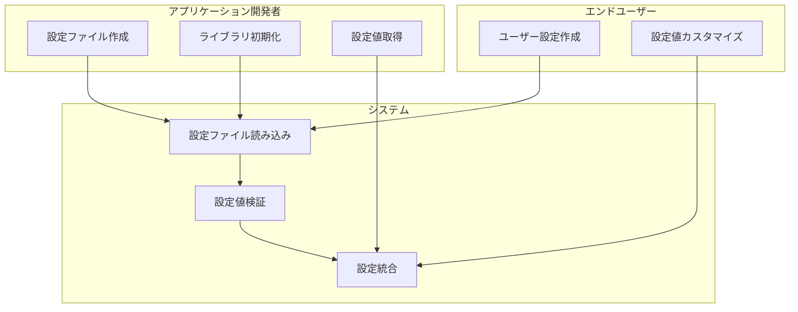
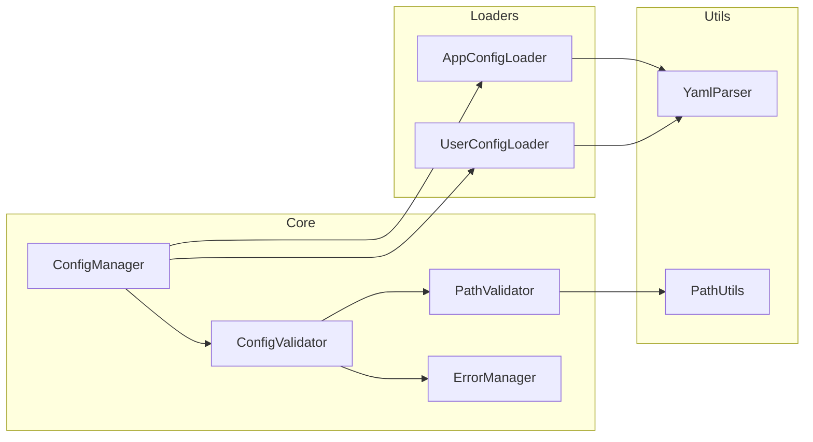
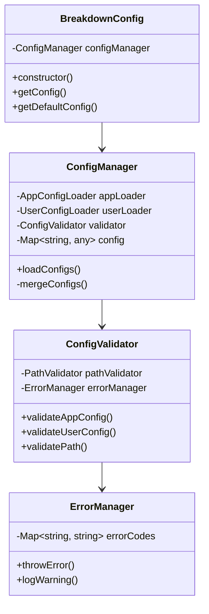
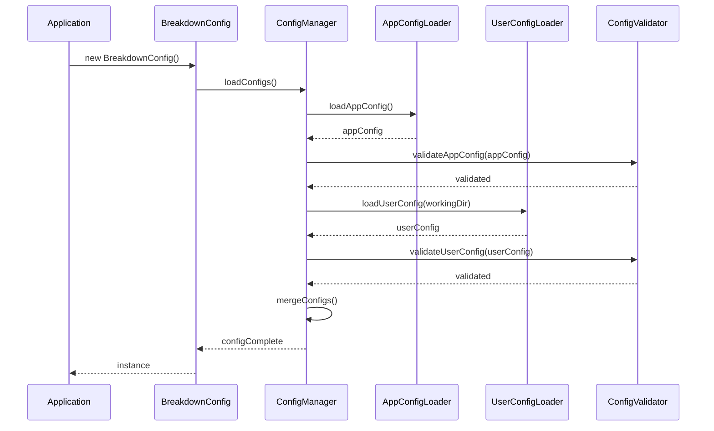
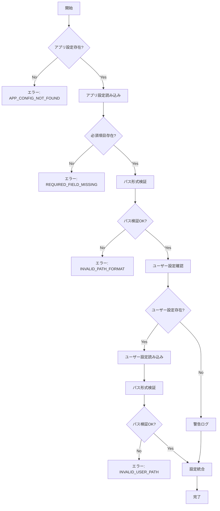
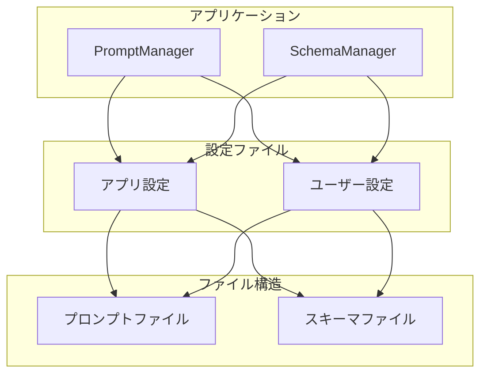

# 開発設計書

## 1. システム概要

breakdownconfig は、アプリケーションの設定ファイルを管理するDenoライブラリです。
アプリケーション設定とユーザー設定の2種類の設定ファイルを統合し、安全に設定値を提供します。

### 1.1 主要機能

- アプリケーション設定ファイルの読み込みと検証
- ユーザー設定ファイルの読み込みと検証（オプショナル）
- 設定値の統合と優先順位の管理
- パス安全性の検証
- エラー管理

### 1.2 制約条件

- 設定ファイルはYAML形式（シンプルな単一ドキュメント）
- パスは相対パスのみ使用可能
- シンボリックリンクは追跡しない
- エラーメッセージは英語のみ対応
- 初期設定値はENUMを使う

## 2. アーキテクチャ設計

### 2.1 ユースケース図



### 2.2 コンポーネント構成



### 2.3 クラス図



## 3. 詳細設計

### 3.1 設定読み込みシーケンス



### 3.2 設定値検証フロー



## 4. エラー設計

### 4.1 エラーコード体系

```typescript
enum ErrorCode {
  // 設定ファイル関連 (1000番台)
  APP_CONFIG_NOT_FOUND = "ERR1001",
  APP_CONFIG_INVALID = "ERR1002",
  USER_CONFIG_INVALID = "ERR1003",

  // 必須項目関連 (2000番台)
  REQUIRED_FIELD_MISSING = "ERR2001",
  INVALID_FIELD_TYPE = "ERR2002",

  // パス検証関連 (3000番台)
  INVALID_PATH_FORMAT = "ERR3001",
  PATH_TRAVERSAL_DETECTED = "ERR3002",
  ABSOLUTE_PATH_NOT_ALLOWED = "ERR3003",

  // その他 (9000番台)
  UNKNOWN_ERROR = "ERR9999",
}
```

## 5. 型定義

### 5.1 設定ファイル型定義

```typescript
interface AppConfig {
  working_dir: string;
  app_prompt: {
    base_dir: string;
  };
  app_schema: {
    base_dir: string;
  };
}

interface UserConfig {
  app_prompt?: {
    base_dir?: string;
  };
  app_schema?: {
    base_dir?: string;
  };
}

interface MergedConfig {
  working_dir: string;
  app_prompt: {
    base_dir: string;
  };
  app_schema: {
    base_dir: string;
  };
  [key: string]: any; // ユーザー設定からの追加項目を許容
}
```

### 5.2 設定統合ルール

1. ユーザー設定は、アプリケーション設定の値を上書きする
2. ネストされた設定の場合：
   - ユーザー設定に存在するキーの最上位階層で上書き
   - 上書き時、既存の下位項目は保持される
   - 明示的に空値が指定された場合のみ、項目は削除される

例：

```yaml
# アプリケーション設定
app_prompt:
  base_dir: "/path/a"
  other_setting: "value"
  deep:
    nested: "value"

# ユーザー設定
app_prompt:
  base_dir: "/path/b"

# 結果
app_prompt:
  base_dir: "/path/b"
  other_setting: "value" # 保持される
  deep:
    nested: "value" # 保持される
```

## 6. テスト設計

テスト設計の詳細は `docs/development_test.ja.md` を参照してください。

## 7. サンプルアプリケーション設計

### 7.1 サンプルアプリケーション概要

サンプルアプリケーションとして、マルチプロンプト管理アプリケーションを実装します。
このアプリケーションは、breakdownconfigを使用して複数のプロンプトファイルとスキーマを管理します。

### 7.2 サンプルアプリケーション構成



### 7.3 ディレクトリ構造

```
examples/
├── prompt-manager/
│   ├── src/
│   │   ├── prompt_manager.ts
│   │   └── schema_manager.ts
│   ├── config/
│   │   ├── app.yml
│   │   └── user.yml
│   ├── prompts/
│   │   ├── app/
│   │   │   └── default.txt
│   │   └── user/
│   │       └── custom.txt
│   ├── schema/
│   │   ├── app/
│   │   │   └── default.json
│   │   └── user/
│   │       └── custom.json
│   └── README.md
└── README.md
```

### 7.4 設定ファイル例

#### アプリケーション設定 (app.yml)

```yaml
working_dir: "./.manager"
app_prompt:
  base_dir: "./prompts/app"
app_schema:
  base_dir: "./schema/app"
```

#### ユーザー設定 (user.yml)

```yaml
app_prompt:
  base_dir: "./prompts/user"
app_schema:
  base_dir: "./schema/user"
```

### 7.5 利用例

```typescript
// 基本的な使用方法
const config = new BreakdownConfig();
await config.loadConfig();
const settings = await config.getConfig();
```
