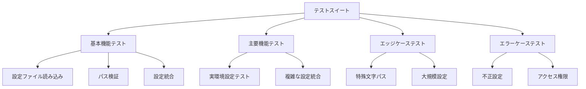

# テスト設計書

## 1. テスト戦略

### 1.1 テスト目標
- 機能の完全性の保証
- エッジケースの網羅
- 実環境での動作保証
- 高いテストカバレッジの維持

### 1.2 テストレベル
1. 単体テスト
   - 各クラスの独立した機能テスト
   - モック/スタブを使用した依存性の分離
2. 統合テスト
   - コンポーネント間の連携テスト
   - 実際の設定ファイルを使用したテスト
3. E2Eテスト
   - 実環境を想定したテスト
   - 実際のアプリケーションでの利用シナリオテスト

## 2. テスト構成

### 2.1 テスト階層



### 2.2 テストケース詳細

#### 基本機能テスト
1. 設定ファイル読み込み
   - アプリ設定の読み込み
   - ユーザー設定の読み込み
   - YAMLパース処理

2. パス検証
   - 相対パスの検証
   - 絶対パスの検出と拒否
   - パストラバーサルの検出
   - シンボリックリンクの処理

3. 設定統合
   - 基本的な設定の統合
   - ネストされた設定の統合
   - 空値による項目の削除

#### 主要機能テスト
1. 実環境設定テスト
   - 実際のディレクトリ構造での動作
   - 実際の設定ファイルでの動作

2. 複雑な設定統合
   - 深いネストの設定統合
   - 大規模な設定ファイルの統合
   - 複数階層の設定統合

#### エッジケーステスト
1. 特殊文字パス
   - 日本語パス
   - 空白を含むパス
   - 特殊記号を含むパス

2. 大規模設定
   - 巨大なYAMLファイル
   - 多数のネスト
   - 大量の設定項目

#### エラーケーステスト
1. 不正設定
   - 不正なYAML形式
   - 必須項目の欠落
   - 不正な型の値

2. アクセス権限
   - 読み取り権限なしのファイル
   - 存在しないパス
   - アクセス不能なディレクトリ

## 3. CI/CD設定

### 3.1 GitHub Actions設定
```yaml
name: Test

on:
  push:
    branches: [ main ]
  pull_request:
    branches: [ main ]

jobs:
  test:
    runs-on: ubuntu-latest
    strategy:
      matrix:
        deno-version: [1.x]

    steps:
    - uses: actions/checkout@v2
    
    - name: Setup Deno
      uses: denoland/setup-deno@v1
      with:
        deno-version: ${{ matrix.deno-version }}
    
    - name: Verify formatting
      run: deno fmt --check
    
    - name: Run linter
      run: deno lint
    
    - name: Run tests
      run: deno test --allow-read --allow-write --coverage=coverage
    
    - name: Generate coverage report
      run: deno coverage coverage --lcov > coverage.lcov
    
    - name: Upload coverage to Codecov
      uses: codecov/codecov-action@v3
      with:
        file: ./coverage.lcov
```

### 3.2 テストカバレッジ要件
- ステートメントカバレッジ: 90%以上
- 分岐カバレッジ: 85%以上
- 関数カバレッジ: 95%以上

### 3.3 テスト環境
- OS: Ubuntu Latest (CI), macOS, Windows
- Denoバージョン: 1.x
- テストフレームワーク: Deno.test

## 4. テストデータ管理

### 4.1 テストフィクスチャ
- 実際のアプリケーション構成に基づくテストデータ
- 各テストケース用の専用設定ファイル
- エッジケース用の特殊データ

### 4.2 ディレクトリ構造
```
tests/
├── fixtures/
│   ├── app_configs/
│   │   ├── valid/
│   │   └── invalid/
│   └── user_configs/
│       ├── valid/
│       └── invalid/
├── unit/
├── integration/
└── e2e/
```

## 5. 品質メトリクス

### 5.1 測定項目
- テストカバレッジ
- テスト実行時間
- 失敗したテストの数
- コードスメル
- 技術的負債

### 5.2 品質目標
- すべてのテストが通過
- カバレッジ目標の達成
- テスト実行時間が3分以内
- コードスメルの検出なし
- 技術的負債の最小化 