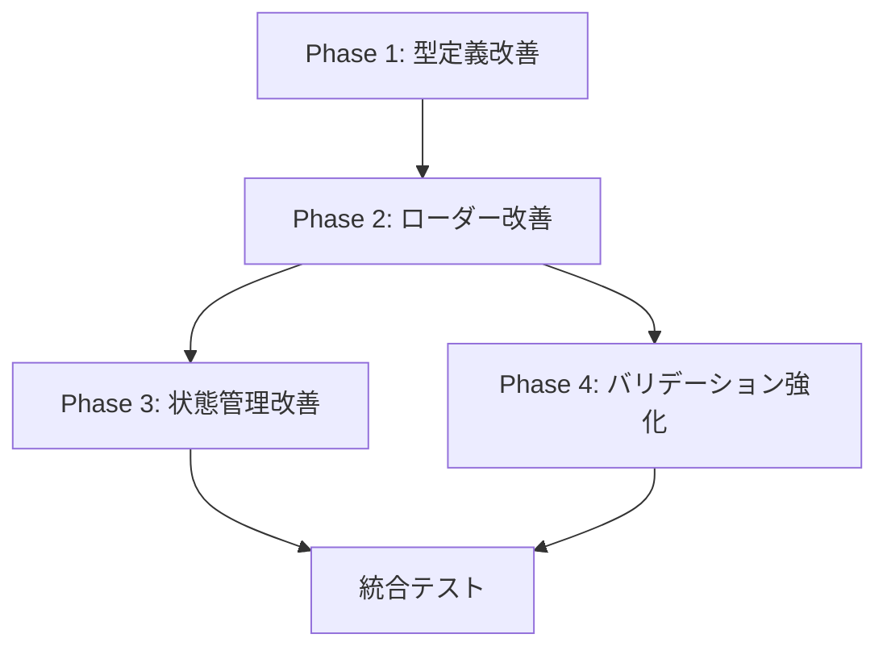

# BreakdownConfig 実装改善計画

## 概要

現在の実装を「全域性（Totality）」の原則に基づいて改善し、型安全で堅牢なコード設計に変更する実装計画。

---

## Phase 1: 型定義の改善（優先度: 高）

### 1.1 Result型の導入

**ファイル**: `src/types/result.ts`

```typescript
// 全ての操作結果を表現するDiscriminated Union
export type Result<T, E> = 
  | { success: true; data: T }
  | { success: false; error: E };

// 設定読み込み専用のResult型
export type ConfigResult<T> = Result<T, ConfigError>;
```

**効果**: エラーハンドリングが型安全になり、例外に依存しない設計が可能。

### 1.2 エラー型の明確化

**ファイル**: `src/types/errors.ts`

```typescript
// エラーをDiscriminated Unionで表現
export type ConfigError = 
  | { kind: "fileNotFound"; path: string; message: string }
  | { kind: "parseError"; path: string; details: string }
  | { kind: "validationError"; errors: ValidationError[] }
  | { kind: "pathError"; path: string; reason: PathErrorReason };
```

**効果**: エラーの種類が明確になり、適切なエラー処理が可能。

### 1.3 Smart Constructorの導入

**ファイル**: `src/types/validated_types.ts`

```typescript
// パスの妥当性を保証するクラス
export class ValidPath {
  private constructor(private readonly value: string) {}
  
  static create(path: string): Result<ValidPath, PathError> {
    // バリデーションロジック
  }
}
```

**効果**: 不正な値を持つインスタンスの生成を防ぎ、実行時エラーを型レベルで排除。

---

## Phase 2: ローダーの全域関数化（優先度: 高）

### 2.1 AppConfigLoaderの改善

**現在の問題**:
```typescript
// 例外を投げる部分関数
async load(): Promise<AppConfig> {
  // エラー時に例外を投げる
  throw new Error("...");
}
```

**改善案**:
```typescript
// 全ての結果を型で表現する全域関数
async load(): Promise<ConfigResult<ValidatedAppConfig>> {
  // 全てのケースで適切な戻り値を返す
  return { success: false, error: { kind: "fileNotFound", ... } };
}
```

### 2.2 UserConfigLoaderの改善

**現在の問題**:
```typescript
// エラーを隠蔽する危険な実装
catch (_error) {
  return {} as UserConfig;
}
```

**改善案**:
```typescript
// エラーと「設定なし」を明確に区別
async load(): Promise<ConfigResult<UserConfig | null>> {
  // ファイル未存在は成功として null を返す
  // エラーは適切なエラー情報と共に返す
}
```

---

## Phase 3: 状態管理の改善（優先度: 中）

### 3.1 ConfigManagerの状態表現

**現在の問題**:
```typescript
private isLoaded = false; // boolean による曖昧な状態表現
```

**改善案**:
```typescript
// 設定の状態をDiscriminated Unionで表現
type ConfigState = 
  | { kind: "notLoaded" }
  | { kind: "loading" }
  | { kind: "loaded"; config: ValidatedConfig }
  | { kind: "error"; error: ConfigError };
```

### 3.2 設定マージ処理の改善

**現在の問題**:
```typescript
// 暗黙的な型変換と部分的なマージ
mergedConfig[key] = String(value);
```

**改善案**:
```typescript
// 型安全な設定マージ
function mergeConfigs(
  app: ValidatedAppConfig, 
  user: ValidatedUserConfig
): ValidatedMergedConfig {
  // 明示的で型安全なマージ処理
}
```

---

## Phase 4: バリデーション強化（優先度: 中）

### 4.1 実行時バリデーションの改善

**現在の問題**:
```typescript
// 散在するバリデーションロジック
private validateConfig(config: unknown): config is AppConfig {
  // 部分的なチェック
}
```

**改善案**:
```typescript
// 包括的で再利用可能なバリデーター
class ConfigValidator {
  static validateAppConfig(data: unknown): ConfigResult<ValidatedAppConfig> {
    // 全フィールドの詳細な検証
  }
}
```

### 4.2 カスタム設定の型安全化

**現在の問題**:
```typescript
[key: string]: unknown; // 過度に寛容な型定義
```

**改善案**:
```typescript
// 明確に定義されたカスタム設定型
type CustomConfig = Record<string, ConfigValue>;
type ConfigValue = string | number | boolean | ConfigValue[] | ConfigObject;
type ConfigObject = { [key: string]: ConfigValue };
```

---

## 実装順序と依存関係



### Step 1: 基盤型の作成
1. `Result<T, E>` 型の定義
2. `ConfigError` 型の定義
3. `ValidPath` クラスの実装

### Step 2: ローダーの段階的移行
1. 新しい `SafeAppConfigLoader` の作成
2. 新しい `SafeUserConfigLoader` の作成
3. 既存ローダーとの並行稼働期間

### Step 3: ConfigManagerの改善
1. 新しい状態管理の導入
2. 型安全なマージ処理の実装
3. エラーハンドリングの統一

### Step 4: 既存コードの置き換え
1. 段階的な移行（feature flag使用）
2. 既存テストの更新
3. 新しい実装でのテスト追加

---

## 期待される改善効果

### 1. バグの早期発見
- **現在**: 実行時にエラーが発生
- **改善後**: コンパイル時に不正状態を検出

### 2. エラーハンドリングの改善
- **現在**: try-catch に依存、エラー情報が曖昧
- **改善後**: 型安全なエラーハンドリング、詳細なエラー情報

### 3. テスタビリティの向上
- **現在**: 例外処理のテストが困難
- **改善後**: 全てのケースが明示的でテスト容易

### 4. 保守性の向上
- **現在**: 状態遷移が不明確
- **改善後**: 型によって状態遷移が明確

### 5. AI生成コードとの親和性
- **現在**: 型制約が弱く、AIが危険なコード生成の可能性
- **改善後**: 強い型制約により、AIが安全なコードを生成

---

## リスク管理

### 破壊的変更の最小化
- 既存のpublic APIは段階的に非推奨化
- 内部実装から徐々に改善
- feature flagによる安全な移行

### テストカバレッジの維持
- 改善前後でのテスト結果の同等性確認
- 新しい型安全性に関するテストの追加

### パフォーマンスの監視
- バリデーション強化による性能影響の測定
- 必要に応じたパフォーマンス最適化

この計画により、現在の部分関数的な実装を、型安全で堅牢な全域関数ベースの設計に段階的に移行できる。
